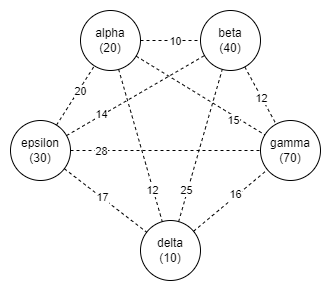
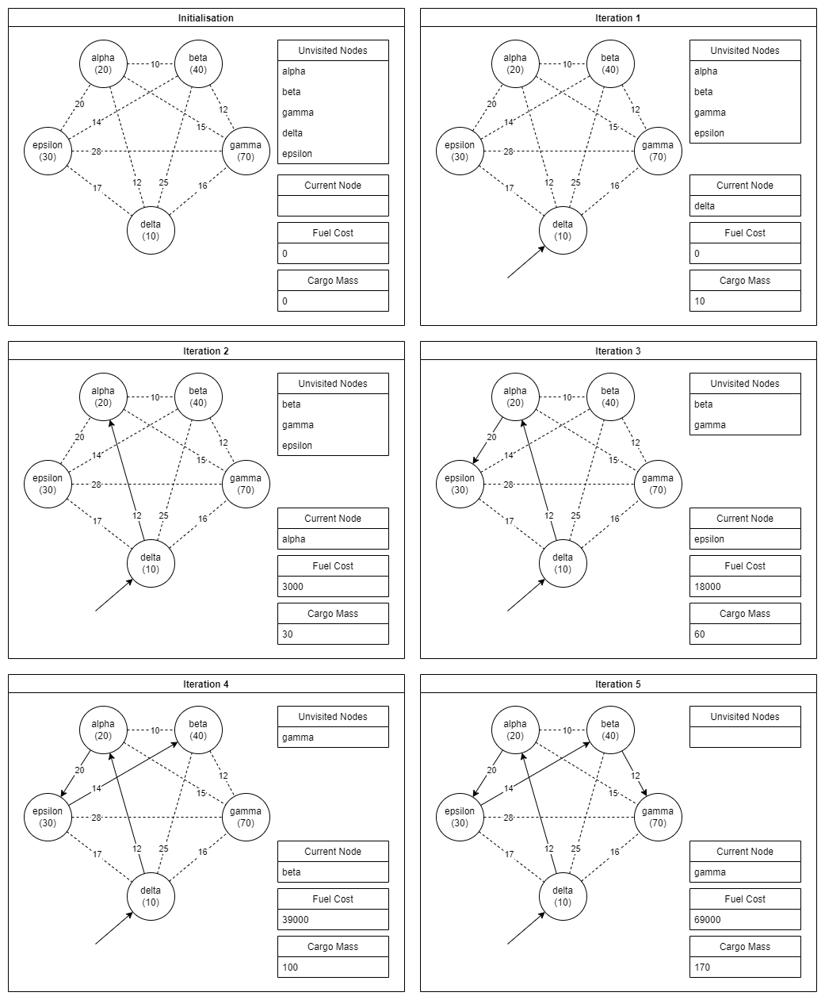
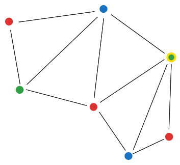

---
geometry:
  - left=30mm
  - right=30mm
---
# Computational Methods
## Task 1 - Brute Force

{ width=50% }


A program was written to brute-force this, as opposed to doing it by hand. Below is the pseudocode.
```
Let adjacency_matrix = {{0,10,15,12,20}, 
						{10,0,12,25,14}, 
						{15,12,0,16,28}, 
						{12,25,16,0,17}, 
						{20,14,28,17,0}}
Let cargo_pickup_weights = [20,40,70,10,30]

Function get_distance(a, b):
	Return adjacency_matrix[a][b]
End Function

Function calculate_fuel_cost(a, b, c, d, e):
	Let total_fuel = 0
	Let total_weight = 0

	total_weight = total_weight + cargo_pickup_weights[a]
	total_fuel = total_fuel + get_distance(a,b)*total_weight

	total_weight = total_weight + cargo_pickup_weights[b]
	total_fuel = total_fuel + get_distance(b,c)*total_weight

	total_weight = total_weight + cargo_pickup_weights[c]
	total_fuel = total_fuel + get_distance(c,d)*total_weight

	total_weight = total_weight + cargo_pickup_weights[d]
	total_fuel = total_fuel + get_distance(d,e)*total_weight

	total_weight = total_weight + cargo_pickup_weights[e]

	Return total_fuel*25
End Function

Let all_possible_sequences = []

Let a = 0
While a < 5:
	Let sequence = [a]

	Let b = 0
	While b < 5:
		If sequence Contains b:
			Continue
		End If
		Append b to sequence

		Let c = 0
		While c < 5:
			If sequence Contains c:
				Continue
			End If
			Append c to sequence

			Let d = 0
			While d < 5:
				If sequence Contains d:
					Continue
				End If
				Append d to sequence

				Let e = 0
				While e < 5:
					If sequence Contains e:
						Continue
					End If
					Append e to sequence

					Append sequence to all_possible_sequences
					sequence = [a,b,c,d]
					Increment e
				End While
				sequence = [a,b,c]
				Increment d
			End While
			sequence = [a,b]
			Increment c
		End While
		sequence = [a]
		Increment b
	End While

	Increment a
End While

Open "brute_force.csv" as file
Let index = 0
While index < Length of all_possible_sequences:
	Let seq = all_possible_sequences[index]
	Output seq[0] to file
	Output "," to file
	Output seq[1] to file
	Output "," to file
	Output seq[2] to file
	Output "," to file
	Output seq[3] to file
	Output "," to file
	Output seq[4] to file
	Output "," to file
	Output calculate_fuel_cost(seq[0], seq[1], seq[2], seq[3], seq[4]) to file
	Output "\n" to file
End While

Close file
```
Below is the equivalent python code.
```
alpha = 0
beta = 1
gamma = 2
delta = 3
epsilon = 4

adjacency_matrix = [[0,10,15,12,20], 
					[10,0,12,25,14], 
					[15,12,0,16,28], 
					[12,25,16,0,17], 
					[20,14,28,17,0]]

cargo_pickup_weights = [20,40,70,10,30]

def get_distance(a, b):
    return adjacency_matrix[a][b]

def calculate_fuel_cost(a, b, c, d, e):
    total_fuel = 0
    total_weight = 0
    
    total_weight += cargo_pickup_weights[a]
    total_fuel += get_distance(a,b)*total_weight

    total_weight += cargo_pickup_weights[b]
    total_fuel += get_distance(b,c)*total_weight

    total_weight += cargo_pickup_weights[c]
    total_fuel += get_distance(c,d)*total_weight

    total_weight += cargo_pickup_weights[d]
    total_fuel += get_distance(d,e)*total_weight

    total_weight += cargo_pickup_weights[e]

    return total_fuel*25


all_possible_sequences = []

for a in range(5):
    sequence = [a]
    for b in range(5):
        if (b in sequence): continue
        sequence.append(b)
        for c in range(5):
            if (c in sequence): continue
            sequence.append(c)
            for d in range(5):
                if (d in sequence): continue
                sequence.append(d)
                for e in range(5):
                    if (e in sequence): continue
                    sequence.append(e)
                    all_possible_sequences.append(sequence)
                    sequence = [sequence[0], sequence[1], sequence[2], sequence[3]]
                sequence = [sequence[0], sequence[1], sequence[2]]
            sequence = [sequence[0], sequence[1]]
        sequence = [sequence[0]]
                    
csv_data = ""
for seq in all_possible_sequences:
    csv_data += str(seq[0]) + ","
    csv_data += str(seq[1]) + ","
    csv_data += str(seq[2]) + ","
    csv_data += str(seq[3]) + ","
    csv_data += str(seq[4]) + ","
    csv_data += str(calculate_fuel_cost(seq[0], seql[1], seq[2], seq[3], seq[4])) + "\n"

print("generated " + str(len(all_possible_sequences)) + " sequences")

file = open("brute_force.csv", "w")

file.write(csv_data)
file.close()
```
See the CSV file which is produced by the python program, and a more formatted Excel conversion.

[c025180n_brute_force.csv](c025180n_brute_force.csv)

[c025180n_brute_force.xlsx](c025180n_brute_force.xlsx)

Reading from the generated files, it can be seen that the cheapest route is `3 0 4 1 2 = Delta -> Alpha -> Epsilon -> Beta -> Gamma`, which costs 69000 intergalactic currency.

This approach isn't a good way to find the shortest path since it requires checking the cost of an enormous and rapidly increasing search space. Specifically $n!$ possible routes, $n$ being the number of planets (Flood, 1956)[^4]; this is because there are $n$ possible planets for the first destination, $n-1$ for the second, etc. Factorial time, $O(n!)$ is a bad time complexity. In order to evaluate the cost of each route, the program also has to traverse the whole list of planets representing each route, which are length $n$, so the real time complexity is $O(n\times n!)$. Optimisations which can be applied are limited since the problem is analogous to the asymmetric travelling salesman problem (i.e. reversed routes are not equal in cost), however we could reduce the number of routes to be checked using a dynamic programming approach, by exploring the graph gradually and comparing partial routes with the same planets visited and the same end planet. This could reduce the time complexity to $O(n^2 2^{n-1})$, but with much worse space complexity (Bellman, 1962)[^5].

\newpage

## Task 2 - Sorting

| 0   | 1   | 2   | 3   | 4   | 5   | 6   | 7   | 8   | 9   | start | end | i   | j   | pivot value | notes                                                          |
| --- | --- | --- | --- | --- | --- | --- | --- | --- | --- | ----- | --- | --- | --- | ----------- | -------------------------------------------------------------- |
| 10  | 15  | 12  | 12  | 25  | 16  | 20  | 14  | 28  | 17  | 0     | 9   | -1  | 10  | 25          | partition the whole list                                       |
|     |     |     |     |     |     |     |     |     |     |       |     | 0   | 10  |             |                                                                |
|     |     |     |     |     |     |     |     |     |     |       |     | 1   | 10  |             |                                                                |
|     |     |     |     |     |     |     |     |     |     |       |     | 2   | 10  |             |                                                                |
|     |     |     |     |     |     |     |     |     |     |       |     | 3   | 10  |             |                                                                |
|     |     |     |     |     |     |     |     |     |     |       |     | 4   | 10  |             |                                                                |
|     |     |     |     |     |     |     |     |     |     |       |     | 4   | 9   |             |                                                                |
| 10  | 15  | 12  | 12  | 17  | 16  | 20  | 14  | 28  | 25  |       |     |     |     |             | swap 4 and 9                                                   |
|     |     |     |     |     |     |     |     |     |     |       |     | 5   | 9   |             |                                                                |
|     |     |     |     |     |     |     |     |     |     |       |     | 6   | 9   |             |                                                                |
|     |     |     |     |     |     |     |     |     |     |       |     | 7   | 9   |             |                                                                |
|     |     |     |     |     |     |     |     |     |     |       |     | 8   | 9   |             |                                                                |
|     |     |     |     |     |     |     |     |     |     |       |     | 8   | 8   |             |                                                                |
|     |     |     |     |     |     |     |     |     |     |       |     | 8   | 7   |             | partitioning finished                                          |
| 10  | 15  | 12  | 12  | 17  | 16  | 20  | 14  |     |     | 0     | 7   | -1  | 8   | 12          | subsort first half                                             |
|     |     |     |     |     |     |     |     |     |     |       |     | 0   | 8   |             |                                                                |
|     |     |     |     |     |     |     |     |     |     |       |     | 1   | 8   |             |                                                                |
|     |     |     |     |     |     |     |     |     |     |       |     | 1   | 7   |             |                                                                |
|     |     |     |     |     |     |     |     |     |     |       |     | 1   | 6   |             |                                                                |
|     |     |     |     |     |     |     |     |     |     |       |     | 1   | 5   |             |                                                                |
|     |     |     |     |     |     |     |     |     |     |       |     | 1   | 4   |             |                                                                |
|     |     |     |     |     |     |     |     |     |     |       |     | 1   | 3   |             |                                                                |
| 10  | 12  | 12  | 15  | 17  | 16  | 20  | 14  |     |     |       |     |     |     |             | swap 1 and 3                                                   |
|     |     |     |     |     |     |     |     |     |     |       |     | 2   | 3   |             |                                                                |
|     |     |     |     |     |     |     |     |     |     |       |     | 2   | 2   |             |                                                                |
|     |     |     |     |     |     |     |     |     |     |       |     | 2   | 1   |             | partitioning finished                                          |
| 10  | 12  |     |     |     |     |     |     |     |     | 0     | 1   | -1  | 2   | 10          | subsort first half of first half                               |
|     |     |     |     |     |     |     |     |     |     |       |     | 0   | 2   |             |                                                                |
|     |     |     |     |     |     |     |     |     |     |       |     | 0   | 1   |             |                                                                |
|     |     |     |     |     |     |     |     |     |     |       |     | 0   | 0   |             | subsort done                                                   |
|     |     | 12  | 15  | 17  | 16  | 20  | 14  |     |     | 2     | 7   | 1   | 8   | 17          | subsort second half of first half                              |
|     |     |     |     |     |     |     |     |     |     |       |     | 2   | 8   |             |                                                                |
|     |     |     |     |     |     |     |     |     |     |       |     | 3   | 8   |             |                                                                |
|     |     |     |     |     |     |     |     |     |     |       |     | 4   | 8   |             |                                                                |
|     |     |     |     |     |     |     |     |     |     |       |     | 4   | 7   |             |                                                                |
|     |     | 12  | 15  | 14  | 16  | 20  | 17  |     |     |       |     |     |     |             | swap 4 and 7                                                   |
|     |     |     |     |     |     |     |     |     |     |       |     | 5   | 7   |             |                                                                |
|     |     |     |     |     |     |     |     |     |     |       |     | 6   | 7   |             |                                                                |
|     |     |     |     |     |     |     |     |     |     |       |     | 6   | 6   |             |                                                                |
|     |     |     |     |     |     |     |     |     |     |       |     | 6   | 5   |             | partitioning finished                                          |
|     |     | 12  | 15  | 14  | 16  |     |     |     |     | 2     | 5   | 1   | 6   | 15          | subsort first half of second half of first half                |
|     |     |     |     |     |     |     |     |     |     |       |     | 2   | 6   |             |                                                                |
|     |     |     |     |     |     |     |     |     |     |       |     | 3   | 6   |             |                                                                |
|     |     |     |     |     |     |     |     |     |     |       |     | 3   | 5   |             |                                                                |
|     |     |     |     |     |     |     |     |     |     |       |     | 3   | 4   |             |                                                                |
|     |     | 12  | 14  | 15  | 16  |     |     |     |     |       |     |     |     |             | swap 3 and 4                                                   |
|     |     |     |     |     |     |     |     |     |     |       |     | 4   | 4   |             |                                                                |
|     |     |     |     |     |     |     |     |     |     |       |     | 4   | 3   |             | partitioning finished                                          |
|     |     | 12  | 14  |     |     |     |     |     |     | 2     | 3   | 1   | 4   | 12          | subsort first half of first half of second half of first half  |
|     |     |     |     |     |     |     |     |     |     |       |     | 2   | 4   |             |                                                                |
|     |     |     |     |     |     |     |     |     |     |       |     | 2   | 3   |             |                                                                |
|     |     |     |     |     |     |     |     |     |     |       |     | 2   | 2   |             | subsort done                                                   |
|     |     |     |     | 15  | 16  |     |     |     |     | 4     | 5   | 3   | 6   | 15          | subsort second half of first half of second half of first half |
|     |     |     |     |     |     |     |     |     |     |       |     | 4   | 6   |             |                                                                |
|     |     |     |     |     |     |     |     |     |     |       |     | 4   | 5   |             |                                                                |
|     |     |     |     |     |     |     |     |     |     |       |     | 4   | 4   |             | subsort done                                                   |
|     |     |     |     |     |     | 20  | 17  |     |     | 6     | 7   | 5   | 8   | 20          | subsort second half of second half of first half               |
|     |     |     |     |     |     |     |     |     |     |       |     | 6   | 8   |             |                                                                |
|     |     |     |     |     |     |     |     |     |     |       |     | 6   | 7   |             |                                                                |
|     |     |     |     |     |     | 17  | 20  |     |     |       |     |     |     |             | swap 6 and 7                                                   |
|     |     |     |     |     |     |     |     |     |     |       |     | 7   | 7   |             |                                                                |
|     |     |     |     |     |     |     |     |     |     |       |     | 7   | 6   |             | subsort done                                                   |
|     |     |     |     |     |     |     |     | 28  | 25  | 8     | 9   | 7   | 10  | 28          | subsort second half                                            |
|     |     |     |     |     |     |     |     |     |     |       |     | 8   | 10  |             |                                                                |
|     |     |     |     |     |     |     |     |     |     |       |     | 8   | 9   |             |                                                                |
|     |     |     |     |     |     |     |     |     |     |       |     |     |     |             | swap 8 and 9                                                   |
|     |     |     |     |     |     |     |     | 25  | 28  |       |     |     |     |             |                                                                |
|     |     |     |     |     |     |     |     |     |     |       |     | 9   | 9   |             |                                                                |
|     |     |     |     |     |     |     |     |     |     |       |     | 9   | 8   |             | subsort done                                                   |
| 10  | 12  | 12  | 14  | 15  | 16  | 17  | 20  | 25  | 28  |       |     |     |     |             | sort done                                                      | 

This trace table represents a quicksort, and below is the pseudocode for it.

```
Procedure swap(array, first, second) Begin:
	Let temp = array[first]
	array[first] = array[second]
	array[second] = temp
End Procedure

Function partition_array(array, start, end) Begin:
	// Place the pivot in the middle, this tends to have better performance
	Let pivot_index = ((end - start)/2 Rounded Down) + start
	Let pivot = array[pivot_index]
	
	// Initialise pointers
	Let i = start - 1
	Let j = end + 1
	
	While True:
		// Increment i then break if the targeted element is swappable
		While True:
			Increment i
			If array[i] >= pivot:
				Break
			End If
		End While
		
		// Decrement j then break if the targeted element is swappable
		While True:
			Decrement j
			If array[j] <= pivot:
				Break
			End If
		End While
		
		// Return the partition point if i and j meet/cross, otherwise swap their values
		If i >= j:
			Return j
		Else:
			swap(array, i, j)
		End If
	End While
End Function

Procedure quick_sort(array, start, end) Begin:
	// Return if there is nothing to sort
	If start >= end:
		Return
	End If
	
	// Perform first sorting pass over current whole array
	Let split_index = partition_array(array, start, end)
	
	// Perform subsorts on partitioned arrays
	quick_sort(array, start, split_index)
	quick_sort(array, split_index + 1, end)
End Procedure
```

This is an implementation of the quicksort algorithm, using Hoare's pivot choice and pair-of-pointers method (Hoare, 1962)[^7]. It makes use of recursive quicksort calls to sort a list by swapping items so that they effectively end up grouped (in each sublist) in groups of larger and smaller items; these sublists can then be sorted using the same method, until there is only one item in each sublist (this is the trivial base case for the recursion), as described by Hoare, the designer of the algorithm. This is an example of a divide-and-conquer approach, as the subsequent quicksorts can be parallelised, since they are independent from one another (Esau Taiwo et al., 2020)[^8]. Quicksort, depending on implementation (particularly choice of pivot) as well as how sorted data already is, usually has worst-case complexity $O(n^2)$. Quicksort also has the advantage that the pointer loops inside `partition_array` can be implemented very efficiently on current standard computer architecture (Deshmukh & Bhavsar, 2020)[^9]. With Hoare's partitioning scheme using the middle-pivot (as opposed to pivoting at the start or end value) tends to have average-case complexity of $O(n \log_2(n))$, often better, and rare worst-case complexity of $O(n^2)$; the worst-case can be further avoided by pivoting on the median of the first, middle, and last elements in the list (Fouz et al., 2011)[^10].

\newpage

## Task 3 - Greedy Strategy

{ width=75% }

\newpage

A greedy strategy chooses the best option in the short term without looking ahead, so two approaches were considered: first, traversing the graph by moving along the **shortest distance edge** to an adjacent unvisited node; second, to traverse along the edge to the **lowest cargo mass** (using mass here to be distinct from edge weights) **adjacent unvisited** node. Each of these methods would repeat until all nodes have been visited. This produces an $O(n(n-1))$ traversal in both cases, traversing $n$ nodes and checking $n-1$ other nodes at each step to decide where to traverse next, which is much better than the $O(n!)$ offered by brute-force. These strategies represent a variation of the nearest neighbour algorithm, NND, as this task is analogous to TSP (Kizilateş & Nuriyeva, 2013)[^12].
The second method produced the route (starting at delta, since it has the lowest cargo mass) `delta -> alpha -> epsilon -> beta -> gamma`, costing **69000**, which is coincidentally the optimal path found by brute-force.
The first approach, starting at the same place, resulted in `delta -> gamma -> beta -> alpha -> epsilon`, which costs almost double the other method at **126500** intergalactic currency.
It follows common sense that a mass-focused route would be better, since mass accumulates during the journey, whereas the edge weightings (distances between planets) do not accumulate. Although a greedy strategy is not guaranteed to find the optimal solution (Vince, 2002)[^13], it will find a reasonably good solution (a local minimum) in polynomial time (Abdulkarim & Alshammari, 2015)[^11].
The problem is considerably simplified by the fact that no consideration is needed for the cargo or fuel capacity for the spaceship, as other similar problems (like F-GVRP) must consider refueling (Poonthalir & Nadarajan, 2018)[^14].

In the implementation, planets are stored as **structures**, containing all the information about them and how they connect, eliminating the need for many list lookups.
It was found that, surprisingly, when constructing the list of connections that each node has with other nodes, it's *better* to not sort the list by cargo mass (which would reduce searching later). The later loop not only needs to find the next lowest cargo mass planet, it needs to *find one which is unvisited*, meaning it performs a linear search through the connected planets regardless. This means choosing between either an $O(n^3)$ sorting pass with an $O(n^2)$ traversal pass, or an $O(n^2)$ preparation pass with an $O(n^2)$ traversal pass, the latter of which is better. Thus the resulting algorithmic complexity of this solution is $O(n^2)$, due to the two occurrences of traversing lists of length $n$, $n$ times over. The pseudocode and C++ implementation are below.

```
Let NUM_PLANETS = 5
Let FUEL_COST = 25

// structure holding data about a planet (i.e. a node)
Structure planet
	Let name = ""
	Let index = 0
	Let cargo_mass = 0
	Let links = {}
End Structure

// starting data about the planets
Let node_names = { "alpha", "beta", "gamma", "delta", "epsilon" }
Let cargo_masses = { 20,40,70,10,30 }
Let adjacency_matrix = { {0,10,15,12,20}, 
						 {10,0,12,25,14}, 
						 {15,12,0,16,28}, 
						 {12,25,16,0,17}, 
						 {20,14,28,17,0} }

// initialise the nodes in the graph
Let planets = {}
Let i = 0
While i < NUM_PLANETS
	Let p = Create planet
	name Of p = node_names[i]
	cargo_mass Of p = cargo_masses[i]
	index Of p = i
	Append p To planets
	
	Increment i
End While

Let p_minimum = planets[0]

// setup links between nodes
For p_origin In planets

	// update the lowest cargo mass planet
	// since we want to start at this planet
	// and this saves using a second loop
	If cargo_mass Of p_origin < cargo_mass Of p_minimum
		p_minimum = p_origin
	End If

	// add links from this node to all other nodes
	// but not itself
	Let i = 0
	While i < NUM_PLANETS
		If planets[i] Not p_origin
			Let distance = adjacency_matrix[i][index Of p_origin]
			Append {planets[i], distance} To links Of p_origin
		End If
		Increment i
	End While
End For

// traverse the graph, keeping track of which planets
// have been visited, and which haven't
Let visited = {}
Fill visited With False NUM_PLANETS Times

Let spaceship_mass = 0
Let fuel_cost = 0
Let sequence = ""

Let p_current = p_minimum
Let p_next Be Empty

Loop Forever

	// find the unvisited planet from the current
	// with the lowest cargo mass, via linear search
	Let minimum_mass = Infinity
	Let d_min_mass = -1
	Let p_min_mass Be Empty

	For l_candidate In links Of p_current
		Let p_candidate = l_candidate[0]
		If visited[index Of p_candidate] = False
			If cargo_mass Of p_candidate < minimum_mass
				minimum_mass = cargo_mass Of p_candidate
				p_min_mass = p_candidate
				d_min_mass = l_candidate[1]
			End If
		End If
	End For

	// if there were no unvisited planets
	// other than the current one, break from the loop
	If p_min_mass Is Empty
		Break Loop
	End If

	// update the next planet we want to visit
	// this will be the one with the next lowest cargo mass
	p_next = p_min_mass
	d_next = d_min_mass

	// add on the calculate fuel cost for the journey between
	// the current planet and the next
	spaceship_mass = spaceship_mass + cargo_mass Of p_current
	fuel_cost = fuel_cost + spaceship_mass * d_next * FUEL_COST

	// update the sequence string
	sequence = sequence + name Of p_current + " -> "

	// mark this planet as visited
	visited[index Of p_current] = true

	// move onto the next planet
	p_current = p_next
End Loop

// finalise and output the result
sequence = sequence + name Of p_current

Output "Found sequence: " + sequence
Output "Costing: " + fuel_cost
```
Below is the C++ implementation.
```
#include <string>
#include <vector>
#include <iostream>

#define NUM_PLANETS 5
#define FUEL_COST 25

using namespace std;

// data about a planet
struct planet
{
	string name;
	int index;
	int cargo_mass;
	vector<pair<planet*, int>> links;
};

int main()
{
	// starting data about planets
	string node_names[NUM_PLANETS] = { "alpha", "beta", "gamma", "delta", "epsilon" };
	int cargo_masses[NUM_PLANETS] = { 20,40,70,10,30 };
	int adjacency_matrix[NUM_PLANETS][NUM_PLANETS] = { {0,10,15,12,20}, 
													   {10,0,12,25,14}, 
													   {15,12,0,16,28}, 
													   {12,25,16,0,17}, 
													   {20,14,28,17,0} };

	// create nodes
	vector<planet*> planets;
	for (int i = 0; i < NUM_PLANETS; i++)
	{
		planet* p = new planet();
		p->name = node_names[i];
		p->cargo_mass = cargo_masses[i];
		p->index = i;

		planets.push_back(p);
	}

	planet* p_minimum = planets[0];

	// setup links between nodes
	for (planet* p_origin : planets)
	{
		// update lowest cargo planet while we're here
		// saves having another loop
		if (p_origin->cargo_mass < p_minimum->cargo_mass)
		{
			p_minimum = p_origin;
		}

		// add links to other nodes
		// not sorted, since sorting them would
		// actually take more time (O(n^2) inside an n-loop)
		for (int i = 0; i < NUM_PLANETS; i++)
		{
			if (planets[i] == p_origin) continue;

			p_origin->links.push_back
				(pair<planet*, int>
					(planets[i],
					adjacency_matrix[i][p_origin->index]
				)
			);
		}
	}

	// traverse, keep list of visited
	bool visited[NUM_PLANETS] = { false };

	int spaceship_mass = 0;
	int fuel_cost = 0;
	string sequence = "";

	planet* p_current = p_minimum;
	planet* p_next = NULL;
	int d_next = 0;

	while (true)
	{
		// find the unvisited planet with the lowest cargo mass
		int minimum_mass = INT_MAX;
		int d_min_mass = -1;
		planet* p_min_mass = NULL;
		for (pair<planet*, int> l_candidate : p_current->links)
		{
			planet* p_candidate = l_candidate.first;
			if (visited[p_candidate->index]) continue;
			if (p_candidate->cargo_mass < minimum_mass)
			{
				minimum_mass = p_candidate->cargo_mass;
				p_min_mass = p_candidate;
				d_min_mass = l_candidate.second;
			}
		}

		// if there were no unvisited planets,
		// other than the current one, break out
		if (p_min_mass == NULL) break;

		// set the planet we intend to visit
		// next (the one with the lowest cargo mass)
		p_next = p_min_mass;
		d_next = d_min_mass;

		// add on the calculated fuel cost
		spaceship_mass += p_current->cargo_mass;
		fuel_cost += spaceship_mass * d_next * FUEL_COST;

		// update the sequence string
		sequence += p_current->name;
		sequence += " -> ";

		// mark it as visited
		visited[p_current->index] = true;

		// move onto the next
		p_current = p_next;
	}

	// output the result
	sequence += p_current->name;

	cout << "Found sequence: " << sequence << endl;
	cout << "Costing: " << fuel_cost << endl;

	return 0;
}
```
Output:
```
Found sequence delta -> alpha -> epsilon -> beta -> gamma
Costing: 69000
```

This implementation could be improved, assuming the graph is fully connected. If this is the case, then no traversal is necessary, the planets can be sorted by cargo mass and the greedy route is the immediate result, producing a solution in $O(n\log(n))$ time complexity.

\newpage

## Task 4 - Dynamic Programming

For the dynamic programming tables, see the files below.

[c025180n_dynamic_programming_alpha.csv](c025180n_dynamic_programming_alpha.csv)

[c025180n_dynamic_programming_beta.csv](c025180n_dynamic_programming_beta.csv)

[c025180n_dynamic_programming_delta.csv](c025180n_dynamic_programming_delta.csv)

[c025180n_dynamic_programming_epsilon.csv](c025180n_dynamic_programming_epsilon.csv)

[c025180n_dynamic_programming_gamma.csv](c025180n_dynamic_programming_gamma.csv)

A C++ program was written to produce these tables, again eliminating the need to traverse the graph by hand. The raw exported CSV files are detailed above, and then the assembled and formatted Excel spreadsheet is can be viewed in this file.

[c025180n_dynamic_programming.xlsx](c025180n_dynamic_programming.xlsx)

The code primarily makes use of a **tree structure** representing the data which is eventually placed in the table, but which is **more compact and easier to traverse**. A `std::queue` was used to keep track of the next block of possible sequences to test, and a `std::map` was used to keep track of the cheapest version of similar routes (used for carrying forward only the better routes). This tree structure makes use of **pointers** to other nodes allocated on the heap. The program is below.
```
#include <map>
#include <string>
#include <queue>
#include <iostream>
#include <fstream>

// allows for much easier debugging
#define NODE_ZERO 65

using namespace std;

// only supports up to 255 nodes, since each node reference is only a single byte/char
#define NUM_NODES 5

// data describing the network
const int adjacency[NUM_NODES][NUM_NODES] = { {  0, 10, 15, 12, 20 },
											  { 10,  0, 12, 25, 14 },
											  { 15, 12,  0, 16, 28 },
											  { 12, 25, 16,  0, 17 },
											  { 20, 14, 28, 17,  0 } };

const int weight[NUM_NODES] = { 20, 40, 70, 10, 30 };
const string names[NUM_NODES] = { "alpha", "beta", "gamma", "delta", "epsilon" };

// struct containing information about a node in the tree
struct cost_tree_node
{
	int cumulative_cost = 0;
	int cumulative_weight = 0;
	string planets_sequence = "";
	unsigned char last_planet = 0;
	cost_tree_node** children = NULL;
	cost_tree_node* parent = NULL;
};

// sort a string sequence alphabetically, but excluding the first and last characters
string sort_sequence(string seq)
{
	if (seq.length() <= 3) return seq;

	string to_sort = seq;

	bool changed = true;
	while (changed)
	{
		changed = false;
		for (int i = 1; i < to_sort.length() - 2; i++)
		{
			if (to_sort[i] > to_sort[i + 1])
			{
				changed = true;
				unsigned char tmp = to_sort[i];
				to_sort[i] = to_sort[i + 1];
				to_sort[i + 1] = tmp;
			}
		}
	}
	return to_sort;
}

// output the cost tree as a table to a file
void write_out_table(cost_tree_node* root)
{
	string output = "prefix,";
	for (int i = NODE_ZERO; i < NODE_ZERO + NUM_NODES; i++)
	{
		output += names[i - NODE_ZERO];
		output += ",";
	}
	output += "\n";

	queue<cost_tree_node*> row_queue;
	row_queue.push(root);

	int block = 0;
	while (!row_queue.empty())
	{
		cost_tree_node* row_starter = row_queue.front();
		row_queue.pop();

		if (row_starter->children == NULL) continue;

		if (row_starter->planets_sequence.length() - 1 > block)
		{
			for (int i = 0; i < NUM_NODES + 1; i++)
			{
				output += " ,";
			}
			output += "\n";
			block = row_starter->planets_sequence.length() - 1;
		}

		for (unsigned char c : row_starter->planets_sequence)
			output += toupper(names[c - NODE_ZERO][0]);
		output += ",";

		for (int i = 0; i < NUM_NODES; i++)
		{
			if (row_starter->children[i] == NULL)
			{
				output += "-,";
				continue;
			}
			output += to_string(row_starter->children[i]->cumulative_cost);
			output += ",";
			row_queue.push(row_starter->children[i]);
		}
		output += "\n";
	}

	ofstream file;
	file.open(names[root->planets_sequence[0] - NODE_ZERO] + ".csv");
	file << output;
	file.close();
}

// build the cost tree, this is the actual dynamic programming bit
cost_tree_node* build_dynamic_cost_tree(unsigned char start_node_index)
{
	// make the specified starting node be the root of the tree
	string root_sequence; root_sequence.push_back(start_node_index);
	cost_tree_node* root = new cost_tree_node
	{
		0,
		weight[start_node_index - NODE_ZERO],
		root_sequence,
		start_node_index,
		NULL,
		NULL
	};

	// nodes that need to have their children populated in this block
	queue<cost_tree_node*> this_block_nodes;

	// new child nodes which are the best route starting 
	// at string[0] and ending at string[-1]
	// i.e. these are the best (cheapest) permutations of a sequence of planets
	map<string, cost_tree_node*> next_block_routes;

	this_block_nodes.push(root);

	// repeat until we reach a block containing 
	// cells representing entire routes through the network
	for (int block = 0; block < NUM_NODES - 1; block++)
	{
		// populate all the rows in the current block
		while (!this_block_nodes.empty())
		{
			// populate the children of a node
			// the parent represents the row label on the left side of a table
			cost_tree_node* parent = this_block_nodes.front();
			this_block_nodes.pop();

			parent->children = new cost_tree_node * [NUM_NODES];

			// calculate the costs of each possible child 
			// node (table cell) from the current parent (table row)
			for (unsigned char c = NODE_ZERO; c < NUM_NODES + NODE_ZERO; c++)
			{
				if (parent->planets_sequence.find(c) != string::npos)
				{
					// discard if the sequence has duplicate planets
					parent->children[c - NODE_ZERO] = NULL;
				}
				else
				{
					// create a new child node (table cell) and calculate 
					// its cumulative weight and cost
					string node_sequence = parent->planets_sequence;
					node_sequence += c;
					cost_tree_node* node = new cost_tree_node
					{
						parent->cumulative_cost + 
							(parent->cumulative_weight 
							* adjacency[parent->last_planet - NODE_ZERO][c - NODE_ZERO]
							),
						parent->cumulative_weight + weight[c - NODE_ZERO],
						node_sequence,
						c,
						NULL,
						parent
					};
					parent->children[c - NODE_ZERO] = node;
					string sorted_seq = sort_sequence(node->planets_sequence);
					if (block >= 2)
					{
						// check to see if this node represents the cheapest way 
						// to travel between its set of planets, with
						// the same start and end points
						auto current_best = next_block_routes.find(sorted_seq);
						// if there are no other routes like this, it must be the best
						if (current_best == next_block_routes.end())
							next_block_routes.insert({ sorted_seq, node });
						// if there are other routes and this one is the cheapest, 
						// update it as the cheapest
						// so that it gets computed in the next block
						else if (node->cumulative_cost < (*current_best).second->cumulative_cost) 
							next_block_routes[sorted_seq] = node;
						// otherwise discard it
					}
					else
					{
						// add the node to the map so that we will 
						// compute its children in the next block
						next_block_routes.insert({ sorted_seq, node });
					}
				}
			}

		}

		// queue up the best routes (table cells) from the last block
		// for evaluation in the next one where they now
		// become the table rows
		for (pair<string, cost_tree_node*> pr : next_block_routes)
		{
			this_block_nodes.push(pr.second);
		}

		// clear and start again
		next_block_routes.clear();
	}

	// write the node tree out as a table to a file
	write_out_table(root);

	// finally iterate over the list of best routes (table cells) in the 
	// last block and find the cheapest one
	cost_tree_node* best_route_through_table = this_block_nodes.front();
	while (!this_block_nodes.empty())
	{
		cost_tree_node* front = this_block_nodes.front();
		this_block_nodes.pop();
		if (front->cumulative_cost < best_route_through_table->cumulative_cost)
		{
			best_route_through_table = front;
		}
	}

	// return the node describing the best (cheapest) way of traversing 
	// the graph, starting at the specified starting point
	return best_route_through_table;
}

int main()
{
	for (int i = NODE_ZERO; i < NUM_NODES + NODE_ZERO; i++)
	{
		cost_tree_node* res = build_dynamic_cost_tree(i);
		cout << res->cumulative_cost * 25 << endl;
		for (unsigned char c : res->planets_sequence) cout << names[c - NODE_ZERO] << " ";
		cout << endl << endl;
	}
}
```

By looking at the *lowest cost table cell* in the *last block of each table* (a block can be defined as a set of rows which have the same number of previously visited planets shown in the far left column, so block 0 has 'A' in the left column, block 1 will have 'AB', 'AG', 'AD', 'AE', etc), the cheapest route starting at the origin node of the table can be found. Thus there will be a single optimal route for each of the 5 generated tables (or however many planets are defined).

- starting at alpha: 69750 (alpha -> delta -> epsilon -> beta -> gamma)

- starting at beta: 105250 (beta -> epsilon -> delta -> alpha -> gamma)

- starting at gamma: 12600 (gamma -> delta -> alpha -> beta -> epsilon)

- starting at delta: 69000 (delta -> alpha -> epsilon -> beta -> gamma)

- starting at epsilon: 69750 (epsilon -> delta -> alpha -> beta -> gamma)

The *best route overall* can be found by taking the cheapest of these optimal routes, `DAEBG for 69000`. This is the same optimal route found by brute force, as would be expected (in fact, the optimal route costs starting from other planets can be verified as the cheapest by looking at the results of the brute force method).

This dynamic approach is guaranteed to find the optimal route, because the program only prunes routes which visit the **same planets** (and thus have the same weight), and **end at the same planet** (i.e. have the same options/edge costs for future traversal steps) but with a **worse cost than other routes satisfying the same conditions**. The dynamic approach solves subproblems recursively, and it can be considered that each 'block' in the table is a sub-level of optimisation where the optimal solutions are found for that particular number of nodes, before another node is added and the problem is optimised again (Rust, 2008)[^22].

In terms of complexity, it can be seen that this is faster than the brute force approach, for two reasons, which correspond to the two main techniques the dynamic approach uses:

1. Memoisation - each time the cost of a route is calculated, only the progression from the previously accumulated cost is calculated, not the entire route cost, reducing time cost to calculate multiple branching routes by caching route costs

2. Pruning - by pruning provably inferior routes at early stages, the search space is massively reduced, eliminating checking of many routes early on (Montero et al., 2017)[^23]

Writing code for this allowed for testing of different numbers of nodes, and the results are displayed below.

| n   | Routes checked to completion | Nodes evaluated | Total possible routes | Nodes evaluated in brute force (equivalent) |
| --- | ---------------------------- | --------------- | --------------------- | ------------------------------------------- |
| 5   | 60                           | 260             | 120                   | 600                                         |
| 6   | 120                          | 990             | 720                   | 4320                                        |
| 7   | 210                          | 3402            | 5040                  | 35280                                       |
| 8   | 336                          | 10808           | 40320                 | 322560                                      |
| 9   | 504                          | 32328           | 362880                | 3265920                                     |

This table shows the huge benefit to pruning compared with the brute force approach. The pattern formed is that the number of routes checked to completion is $n(n-1)(n-2)$ when $n=5$. This is because at each step, we prune such that the number of routes to examine in the next block is halved, then thirded, etc, leaving only $n(n-1)(n-2)=\frac{n!}{(n-3)!}$ routes checked to completion.

We can find that the number of evaluations (i.e. calculating the cost of a node, and deciding if it should be pruned or carried forward) is  $n!\sum_{r=0}^{r=n-2} \frac{1}{(n-(r+2))!|r-1|!}$. This represents the total number of filled cells in the table, and the effect of pruning means multiplying the $n!$ total number of routes by summed fractions, where each fraction is representing 1 divided by the ratio of nodes we prune at each step. The equivalent number of evaluations in the brute-force approach equals the number of routes multiplied by the number of nodes, considering time taken to calculate the cost of a particular route, totaling $n!\times n$. This shows that the dynamic approach has much better time complexity than brute-force, and this complexity approximates reasonably well in rate of increase when compared to that found by Bellman's findings (Bellman, 1962)[^5].

The complexity of checking for alternative routes with the same nodes ('ABGD' vs 'AGBD') must also be considered. This implementation uses an $O(n^2)$ bubble sort, so overall this implementation has a time complexity of $O(n^2\times n!\sum_{r=0}^{r=n-2} \frac{1}{(n-(r+2))!|r-1|!})$. The algorithm could be improved with the use of a better method for route comparison which instead hashes the sequence, potentially reducing this to linear $O(n)$ time.

\newpage

## Task 5 - Art Gallery Problem

The art gallery problem is a geometric optimisation problem in which an uneven, concave 2D polygon must have the minimum possible number of 'guards' posted at discrete points on or within the polygon such that the entire polygon is 'visible' to the guards (i.e. there is an unbroken ray that leads from any point on any edge to at least one guard) (Michael & Pinciu, 2016)[^15]. Depending on constraints, this problem has been shown to be NP-hard, meaning it's both difficult to solve and difficult to verify in polynomial time (Lee and Lin, 1986)[^6].

The analogy is referential to an art gallery, with rooms of different shapes, which may be concave and possibly have disconnected obstacles (pillars), though this varies between definitions of the problem. The artworks must be kept safe from theft or vandalism, while minimising the number of guards required to guard it. We assume that guards have 360 degree vision.

Chvátal showed that the maximum possible number of guards required was equal to $\frac{n}{3}$ , where $n$ is the number of vertices in the polygon. A single guard is able to observe the whole of a convex shape (of which a triangle is the simplest and always convex), since no matter where within the shape an observation point is placed, direct lines can be drawn to all the corners of the shape. Since any polygon may be triangulated (Garey et al., 1978)[^16], and each triangle consumes at most 3 vertices from the polygon (e.g. where the polygon consists of a number of disconnected triangles which share no vertices with one another), at most $\frac{n}{3}$ guards are required, or one per triangle (Chvatal, 2004)[^1].

The number of guards required can be reduced since many triangles will share at least one vertex with a neighbour, usually sharing two, saving one guard each time two triangles share an edge since a guard can be placed at one of the shared vertices and observe both polygons. It is true that a triangulated polygon can be 3-coloured, such that all triangles have exactly one of each of three colours on their vertices (O'Rourke, 2012)[^17]. Fisk points out that by taking the total number of vertices coloured with a the colour with the fewest instances in the polygon (i.e. in a polygon with 2 red, 1 green and 1 blue vertices, take either 1 green or 1 blue) the maximum number of guards required is reduced (Aigner and Ziegler, 2018)[^2]. This is a geometric presentation of the 'sharing vertices' concept described earlier.

Both of these geometric proofs reduce the search space in terms of finding solutions for smaller numbers of guards by setting an upper bound. Fisk's proof even provides a starting point of candidate guard placements. However, these approaches are somewhat naive as they cannot optimise concave shapes where vertices are not shared, since they really only consider topology, and not the actual shape of the polygon in question.

{ width=60% }


Consider Fig. 3: Chvatal's proof shows that a maximum of three guards (there are seven vertices, and the formula rounds up) are needed, and Fisk's proof reduces that bound to at most two guards (these could be placed at the two green vertices, or the two blue ones). However, looking at the polygon, one can clearly see that only a single guard is needed, placed at the highlighted green vertex. Human viewers can apply a heuristic and observe that although the shape is concave, this vertex can observe all of it. Every part of the polygon that the other green vertex can observe, can also be observed by the highlighted vertex, plus a bit more.

An algorithm to optimise this problem (to minimise the number of guards) would need to be able to look at different combinations of guard placements to see if the number of guards can be reduced (i.e. brute-force). Heuristics could be applied, for example by counting around vertices and looking at their corner angles relative to the origin vertex to see if there are occluded (invisible from that point). A dynamic approach could be used: checking for each vertex, which other vertices are visible to it, and iteratively eliminating those with poorest visibility to narrow the search space (using Fisk's limit to restrict the search space as well).

Approximation methods sometimes use a grid to check the coverage of the polygon from certain vertices in the shape, which could be resolved to smaller granularities to more precisely map the space as needed, although even this approach has been found to be NP-hard (Biedl et. al., 2012)[^18].

One approach presented is to reduce the the overall polygon to a set of convex polygons, each of which may be observed by a single guard (Ghosh, 1987)[^3]. However, even this may not produce optimal results, see Fig. 3 again.

It's important to note that there are several variations of the problem which allow guards to be placed on edges, or even anywhere within the polygon, and which allow/disallow holes in the polygon (which are analogous to pillars in a gallery). Polygons may also be restricted to being orthogonal (i.e. having all squared edges); all of these combinations of conditions affect the number of possible configurations and methods for verifying solutions, though nearly all have been proven NP-hard (Kröller et al, 2012)[^19], (Schuchardt and Hecker, 1995)[^20].

One application of the art gallery problem is laser-scanning of interiors, where the goal is to minimise the number of scans taken (Kröller et al, 2012)[^19], which means placing the 'guards' anywhere inside the polygon. Another example is generating navigation routes for autonomous robotics in environments with many obstacles/holes (Lulu & Elnagar, 2007)[^21].


[^1]: Chvátal, V. (2004) _'A combinatorial theorem in plane geometry'_, _Journal of Combinatorial Theory, Series B_. Available at: https://www.sciencedirect.com/science/article/pii/0095895675900611 (Accessed: 29 October 2023).
[^2]: Aigner, M., Ziegler, G.M. (2018). _'How to guard a museum. In: Proofs from THE BOOK'_. Springer, Berlin, Heidelberg. https://doi.org/10.1007/978-3-662-57265-8_40
[^3]: Ghosh, S. K. (1987), _'Approximation algorithms for art gallery problems'_, _Proc. Canadian Information Processing Society Congress_, pp. 429–434.
[^4]: Flood, M. M. (1956), _‘The Traveling-Salesman Problem.’,_  _Operations Research_, 4(1), pp. 61–75. Available at: http://www.jstor.org/stable/167517 (Accessed: 20 November 2023).
[^5]: Bellman, R. (1962) _‘Dynamic programming treatment of the travelling salesman problem’_, _Journal of the ACM_, 9(1), pp. 61–63. doi:10.1145/321105.321111.
[^6]: Lee, D. and Lin, A. (1986) _‘Computational complexity of art gallery problems’_, _IEEE Transactions on Information Theory_, 32(2), pp. 276–282. doi:10.1109/TIT.1986.1057165.
[^7]: Hoare, C. A. R. (1962) _‘Quicksort’_, _The Computer Journal_, 5(1), pp. 10–16. doi:10.1093/comjnl/5.1.10.
[^8]: Esau Taiwo, O. _et al._ (2020) _‘Comparative study of two divide and conquer sorting algorithms: Quicksort and Mergesort’_, _Procedia Computer Science_, 171, pp. 2532–2540. doi:10.1016/j.procs.2020.04.274.
[^9]: Deshmukh, S.M., Bhavsar, A.K. (2020) _‘A Review on Different Quicksort Algorithms’_, _International Journal of Science, Spirituality, Business and Technology_, 7(2), pp. 3–7.
[^10]: Fouz, M. _et al._ (2011) _‘On smoothed analysis of quicksort and Hoare’s find’_, _Algorithmica_, 62(3–4), pp. 879–905. doi:10.1007/s00453-011-9490-9.
[^11]: Abdulkarim, H.A., Alshammari, I.F., (2015) _'Comparison of algorithms for solving traveling salesman problem.'_ _International Journal of Engineering and Advanced Technology_, 4(6), pp. 76-79.
[^12]: Kizilateş, G., Nuriyeva, F. (2013) _‘On the nearest neighbor algorithms for the traveling salesman problem’_, _Advances in Intelligent Systems and Computing_, pp. 111–118. doi:10.1007/978-3-319-00951-3_11.
[^13]: Vince, A. (2002) _‘A framework for the greedy algorithm’_, _Discrete Applied Mathematics_, 121(1–3), pp. 247–260. doi:10.1016/s0166-218x(01)00362-6.
[^14]: Poonthalir, G., Nadarajan, R. (2018) _‘A fuel efficient green vehicle routing problem with varying speed constraint (F-GVRP)’_, _Expert Systems with Applications_, 100, pp. 131–144. doi:10.1016/j.eswa.2018.01.052.
[^15]: Michael, T.S., Pinciu, V. (2016) _‘The orthogonal art gallery theorem with Constrained Guards’_, _Electronic Notes in Discrete Mathematics_, 54, pp. 27–32. doi:10.1016/j.endm.2016.09.006.
[^16]: Garey, M.R., Johnson, D.S., Preparata, F.P., Tarjan, R.E. (1978) _'Triangulating a simple polygon.'_, _Information Processing Letters_, 7(4), pp. 175-179.
[^17]: O’Rourke, J. (2012) _Art Gallery Theroems and Algorithms_, _Art Gallery theorems and algorithms_. Available at: http://www.science.smith.edu/~jorourke/books/ArtGalleryTheorems/art.html (Accessed: 23 November 2023).
[^18]: Biedl, T. _et al._ (2012) _'The Art Gallery Theorem for Polyominoes.'_ _Discrete & Computational Geometry_, 48, pp. 711–720. https://doi.org/10.1007/s00454-012-9429-1
[^19]: Kröller, A. _et al._ (2012) _‘Exact Solutions and Bounds for General Art Gallery Problems’_, _ACM J. Exp. Algorithmics_. New York, NY, USA: Association for Computing Machinery, 17. doi:10.1145/2133803.2184449.
[^20]: Schuchardt, D., Hecker, H.D. (1995). _'Two NP‐Hard Art‐Gallery Problems for Ortho‐Polygons.'_ _Mathematical Logic Quarterly_, 41(2), pp. 261-267. doi:10.1002/malq.19950410212.
[^21]: Lulu, L., Elnagar, A. (2007) _‘An art gallery-based approach: Roadmap construction and path planning in global environments’_, _International Journal of Robotics and Automation_, 22(4). doi:10.2316/journal.206.2007.4.206-3059.
[^22]: Rust, J. (2008) _'Dynamic programming.'_ _The new Palgrave dictionary of economics_, 1, p.8.
[^23]: Montero, A., Méndez-Díaz, I., Miranda-Bront, J.J. (2017) _‘An integer programming approach for the time-dependent traveling salesman problem with time windows’_, _Computers &amp; Operations Research_, 88, pp. 280–289. doi:10.1016/j.cor.2017.06.026.

\newpage
## Bibliography

Chvátal, V. (2004) _'A combinatorial theorem in plane geometry'_, _Journal of Combinatorial Theory, Series B_. Available at: https://www.sciencedirect.com/science/article/pii/0095895675900611 (Accessed: 29 October 2023).

Aigner, M., Ziegler, G.M. (2018). _'How to guard a museum. In: Proofs from THE BOOK'_. Springer, Berlin, Heidelberg. https://doi.org/10.1007/978-3-662-57265-8_40.

Ghosh, S. K. (1987), _'Approximation algorithms for art gallery problems'_, _Proc. Canadian Information Processing Society Congress_, pp. 429–434.

Flood, M. M. (1956), _‘The Traveling-Salesman Problem.’,_  _Operations Research_, 4(1), pp. 61–75. Available at: http://www.jstor.org/stable/167517 (Accessed: 20 November 2023).

Bellman, R. (1962) _‘Dynamic programming treatment of the travelling salesman problem’_, _Journal of the ACM_, 9(1), pp. 61–63. doi:10.1145/321105.321111.

Lee, D. and Lin, A. (1986) _‘Computational complexity of art gallery problems’_, _IEEE Transactions on Information Theory_, 32(2), pp. 276–282. doi:10.1109/TIT.1986.1057165.

Hoare, C. A. R. (1962) _‘Quicksort’_, _The Computer Journal_, 5(1), pp. 10–16. doi:10.1093/comjnl/5.1.10.

Esau Taiwo, O. _et al._ (2020) _‘Comparative study of two divide and conquer sorting algorithms: Quicksort and Mergesort’_, _Procedia Computer Science_, 171, pp. 2532–2540. doi:10.1016/j.procs.2020.04.274.

Deshmukh, S.M., Bhavsar, A.K. (2020) _‘A Review on Different Quicksort Algorithms’_, _International Journal of Science, Spirituality, Business and Technology_, 7(2), pp. 3–7.

Fouz, M. _et al._ (2011) _‘On smoothed analysis of quicksort and Hoare’s find’_, _Algorithmica_, 62(3–4), pp. 879–905. doi:10.1007/s00453-011-9490-9.

Abdulkarim, H.A., Alshammari, I.F., (2015) _'Comparison of algorithms for solving traveling salesman problem.'_ _International Journal of Engineering and Advanced Technology_, 4(6), pp. 76-79.

Kizilateş, G., Nuriyeva, F. (2013) _‘On the nearest neighbor algorithms for the traveling salesman problem’_, _Advances in Intelligent Systems and Computing_, pp. 111–118. doi:10.1007/978-3-319-00951-3_11.

Vince, A. (2002) _‘A framework for the greedy algorithm’_, _Discrete Applied Mathematics_, 121(1–3), pp. 247–260. doi:10.1016/s0166-218x(01)00362-6.

Poonthalir, G., Nadarajan, R. (2018) _‘A fuel efficient green vehicle routing problem with varying speed constraint (F-GVRP)’_, _Expert Systems with Applications_, 100, pp. 131–144. doi:10.1016/j.eswa.2018.01.052.

Michael, T.S., Pinciu, V. (2016) _‘The orthogonal art gallery theorem with Constrained Guards’_, _Electronic Notes in Discrete Mathematics_, 54, pp. 27–32. doi:10.1016/j.endm.2016.09.006.

Garey, M.R., Johnson, D.S., Preparata, F.P., Tarjan, R.E. (1978) _'Triangulating a simple polygon.'_, _Information Processing Letters_, 7(4), pp. 175-179.

O’Rourke, J. (2012) _Art Gallery Theorems and Algorithms_, _Art Gallery theorems and algorithms_. Available at: http://www.science.smith.edu/~jorourke/books/ArtGalleryTheorems/art.html (Accessed: 23 November 2023).

Biedl, T. _et al._ (2012) _'The Art Gallery Theorem for Polyominoes.'_ _Discrete & Computational Geometry_, 48, pp. 711–720. https://doi.org/10.1007/s00454-012-9429-1.

Kröller, A. _et al._ (2012) _‘Exact Solutions and Bounds for General Art Gallery Problems’_, _ACM J. Exp. Algorithmics_. New York, NY, USA: Association for Computing Machinery, 17. doi:10.1145/2133803.2184449.

Schuchardt, D., Hecker, H.D. (1995). _'Two NP‐Hard Art‐Gallery Problems for Ortho‐Polygons.'_ _Mathematical Logic Quarterly_, 41(2), pp. 261-267. doi:10.1002/malq.19950410212.

Lulu, L., Elnagar, A. (2007) _‘An art gallery-based approach: Roadmap construction and path planning in global environments’_, _International Journal of Robotics and Automation_, 22(4). doi:10.2316/journal.206.2007.4.206-3059.

Rust, J. (2008) _'Dynamic programming.'_ _The new Palgrave dictionary of economics_, 1, p. 8.

Montero, A., Méndez-Díaz, I., Miranda-Bront, J.J. (2017) _‘An integer programming approach for the time-dependent traveling salesman problem with time windows’_, _Computers &amp; Operations Research_, 88, pp. 280–289. doi:10.1016/j.cor.2017.06.026.